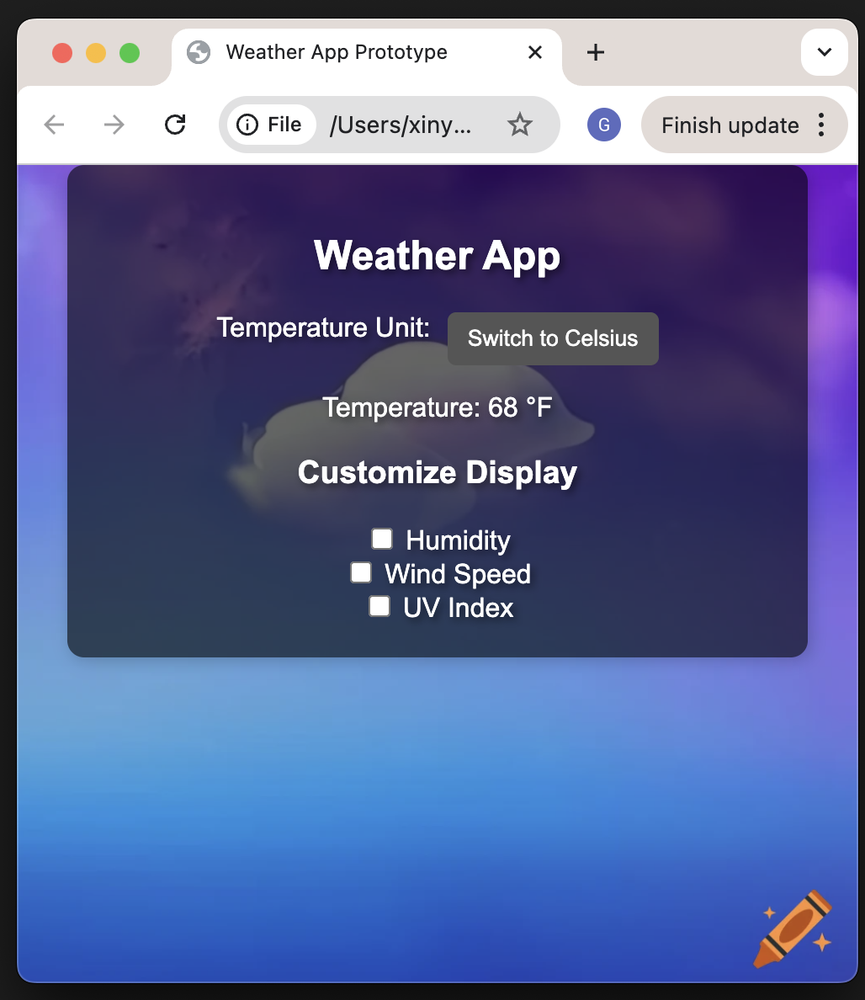
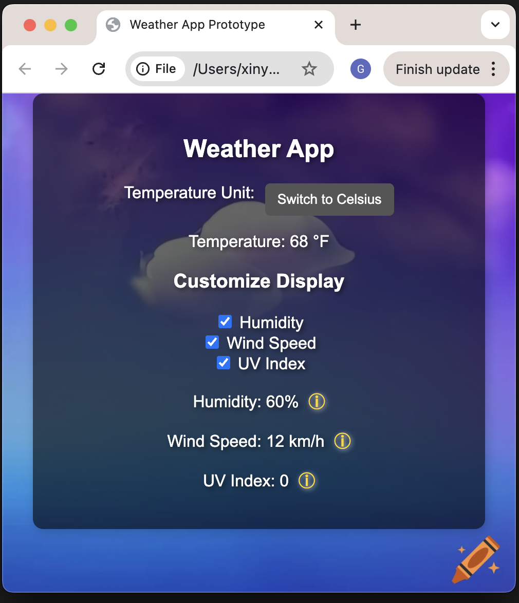
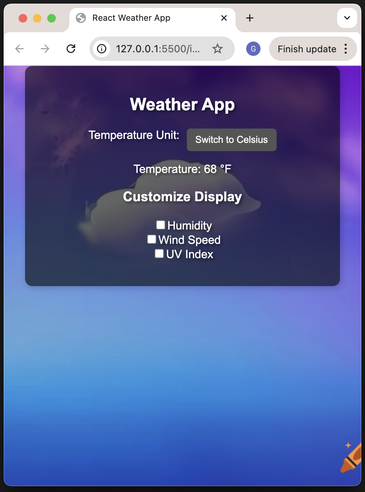
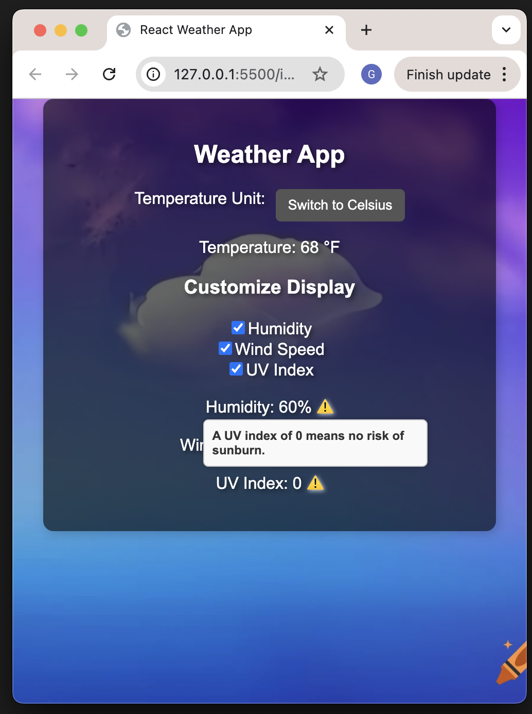

# CIS5120 Core Assignment 4 Reacting Programming Add-on (Guangyao Dou)

The video of this working React programming for the weather app can be found [here](https://upenn.zoom.us/rec/share/cx_1Jg6b80HwhIwuzX-EfSyJYL1ChVIUT3UrG3hFeo1T3Jn9qwrdwamD7O41sYdM.p2ZCsPTCcOpyO2TG?startTime=1742872182000) with Passcode: 7ZT3b$QM, or you can see it from the google drive [here](https://drive.google.com/file/d/1cNpAZO9p2j5mbycnYZwpf0YuaIGUn2xG/view?usp=sharing).
## Core Assignment 1 - Initial Weather App

You can find the source code of my core assignment 1 [here](https://github.com/guangyaodou/cis5120_assignment_1).

Here is a screenshot of the homepage of my first Core Assignment: 

And here is a screenshot showing all the information displayed in my first Core Assignment:

## Core Assignment 4 React Programming Add-on

Here is a screenshot of the homepage of my Core Assignment 4 add-on: 

And here is a screenshot showing all the information displayed in my Core Assignment 4 add-on:

